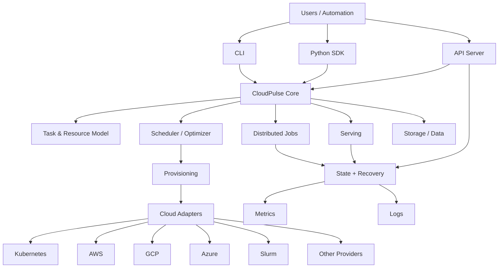

# CloudPulse

<p align="center">
  <strong>Distributed Cloud Infrastructure & Event Processing Platform</strong>
</p>

<p align="center">
  <em>Provision, schedule, execute, serve, and observe distributed workloads across heterogeneous cloud infrastructure from one control plane.</em>
</p>

<p align="center">
  <a href="#-overview">Overview</a> ·
  <a href="#-architecture">Architecture</a> ·
  <a href="#-capabilities">Capabilities</a> ·
  <a href="#-quick-start">Quick Start</a> ·
  <a href="#-deployment">Deployment</a> ·
  <a href="#-development">Development</a>
</p>

<p align="center">
  
  
  
  
</p>

---

## What is CloudPulse?

**CloudPulse** is a distributed cloud infrastructure and event-driven workload platform designed to operate compute-intensive workloads across a mix of public clouds, Kubernetes clusters, Slurm environments, and other infrastructure providers.

Instead of coupling an application to one provider or one cluster, CloudPulse introduces a unified control plane for:

- **Resource orchestration** — discover, provision, configure, and tear down compute.
- **Workload scheduling** — place jobs against available CPU, GPU, TPU, memory, storage, and topology constraints.
- **Event-driven execution** — track workload lifecycle events, state transitions, logs, failures, recovery, and completion.
- **Multi-cloud operations** — use one workload model across heterogeneous infrastructure.
- **Production serving** — deploy and autoscale long-running services and inference endpoints.
- **Fleet efficiency** — bin-pack workloads, reclaim idle capacity, and optimize placement.
- **Platform APIs** — expose orchestration through a client SDK, CLI, API server, and web-facing services.
- **Operational visibility** — collect metrics, inspect state, stream logs, and diagnose failures.

### The core idea

```text
                  ┌───────────────────────────────────────┐
                  │             CloudPulse                │
                  │        Unified Control Plane          │
                  └───────────────────┬───────────────────┘
                                      │
             ┌────────────────────────┼────────────────────────┐
             │                        │                        │
             ▼                        ▼                        ▼
      Workload API             Scheduler / Optimizer      Event + State
      CLI / SDK                Placement / Recovery       Metrics / Logs
             │                        │                        │
             └────────────────────────┼────────────────────────┘
                                      │
                         ┌────────────▼────────────┐
                         │   Infrastructure Layer  │
                         └────────────┬────────────┘
                                      │
          ┌───────────────┬───────────┼───────────┬───────────────┐
          ▼               ▼           ▼           ▼               ▼
      Kubernetes        AWS         GCP        Azure           Slurm
          │               │           │           │               │
          └───────────────┴───────────┼───────────┴───────────────┘
                                      │
                              Compute / GPU / TPU
```

---

## ✨ Why CloudPulse?

Modern distributed workloads rarely live on a single machine, cluster, or cloud. Infrastructure changes continuously: capacity appears and disappears, workloads fail, resources become idle, and teams need to move computation without rewriting the application.

CloudPulse separates **what a workload needs** from **where that workload runs**.

That separation enables:

| Problem | CloudPulse approach |
|---|---|
| Provider-specific infrastructure | Unified workload and resource abstractions |
| Fragmented clusters | Multi-cluster control plane |
| Capacity shortages | Placement strategies and failover |
| Idle resources | Automatic lifecycle management |
| Complex distributed jobs | Multi-node and gang-style scheduling |
| Long-running services | Serving controllers and autoscaling |
| Operational debugging | Centralized state, logs, and metrics |
| Platform integration | Python SDK + CLI + API server |
| Infrastructure changes | Declarative workload definitions |

---

## 🧩 Capabilities

### Multi-cloud & multi-cluster orchestration

CloudPulse contains provider integrations and provisioning workflows for a broad range of environments, including:

- Kubernetes
- Slurm
- AWS
- Google Cloud
- Microsoft Azure
- Oracle Cloud Infrastructure
- IBM Cloud
- RunPod
- Lambda Cloud
- Vast
- Paperspace
- Cudo
- Fluidstack
- Nebius
- DigitalOcean
- VMware vSphere
- SSH-based infrastructure
- Additional provider adapters under `sky/clouds/` and `sky/provision/`

The abstraction is intentionally provider-neutral: workload definitions describe **requirements**, while the platform handles **placement and infrastructure execution**.

### Intelligent workload scheduling

CloudPulse provides the building blocks for:

- Resource-aware placement
- GPU/accelerator selection
- Multi-node workloads
- Gang-style scheduling
- Queue management
- Bin-packing
- Recovery and retry strategies
- Autostop / idle-resource cleanup
- Cross-cluster and cross-cloud placement
- Capacity-aware provisioning

### Distributed jobs

The jobs subsystem manages workloads beyond the initial provisioning step:

```text
Submit
  │
  ▼
Queue
  │
  ▼
Schedule ───────► Provision
  │                  │
  │                  ▼
  │              Initialize
  │                  │
  ▼                  ▼
Running ◄──────── Execute
  │
  ├────────► Logs / Metrics
  │
  ├────────► Recovery
  │
  └────────► Complete / Cancel
```

This lifecycle-oriented model makes infrastructure state and workload state first-class concepts.

### Production serving

The serving subsystem supports persistent services with components for:

- Replica management
- Autoscaling
- Load balancing
- Placement
- Service state
- Controller coordination
- Endpoint management

This makes the same infrastructure layer useful for both **batch workloads** and **long-running services**.

### API server & platform control plane

CloudPulse includes a client/server architecture with:

- REST/API server components
- Authentication and authorization
- API versioning
- State management
- Server-side workload execution
- Service accounts
- Metrics endpoints
- Streaming/logging utilities
- Administrative policies
- Database-backed state

The architecture is suitable for turning a local orchestration tool into a shared internal platform.

### Observability

Operational components include:

- Prometheus-compatible metrics
- Structured state tracking
- Job and service status
- Streaming logs
- Server diagnostics
- Debug dumps
- Database-backed operational metadata
- Health and version checks

---

## 🏗️ Architecture

At a high level, the repository is organized around six layers:



### Repository map

| Path | Responsibility |
|---|---|
| `sky/` | Core Python platform and runtime |
| `sky/client/` | CLI, SDK, authentication, client utilities |
| `sky/server/` | API server, state, auth, REST/WebSocket infrastructure |
| `sky/clouds/` | Cloud/provider abstractions |
| `sky/provision/` | Provider-specific provisioning implementations |
| `sky/jobs/` | Managed/distributed job lifecycle |
| `sky/serve/` | Long-running services and autoscaling |
| `sky/optimizer.py` | Resource optimization and placement logic |
| `sky/resources.py` | Resource requirements and infrastructure abstraction |
| `sky/task.py` | Workload/task model |
| `sky/data/` | Data and storage abstractions |
| `sky/metrics/` | Operational metrics |
| `charts/` | Helm/Kubernetes deployment assets |
| `examples/` | Practical workload and deployment examples |
| `docs/` | User and developer documentation |
| `agent/` | Agent-oriented workflows and references |
| `tests/` | Unit, integration, smoke, and platform tests |
| `addons/` | Supporting infrastructure components |
| `llm/` | LLM-oriented workload examples and tooling |

> **Compatibility note:** the repository currently retains the internal Python namespace and executable entry point under `sky` for compatibility with the existing implementation. **CloudPulse** is the public product/project identity. A future namespace migration can be performed separately without coupling it to the branding migration.

---

## 🚀 Quick Start

### Requirements

- Python **3.9+**
- Linux, macOS, or a supported development environment
- Git
- Access credentials for whichever infrastructure provider you intend to use
- Optional: Kubernetes, Slurm, or cloud CLIs depending on the target environment

### Install from source

```bash
git clone <your-cloudpulse-repository-url>
cd cloudpulse

python -m venv .venv
source .venv/bin/activate

python -m pip install --upgrade pip
pip install -e .
```

For development dependencies:

```bash
pip install -r requirements-dev.txt
```

Verify the installation:

```bash
sky --help
```

### Define a workload

CloudPulse workloads can be expressed declaratively. A minimal example:

```yaml
resources:
  accelerators: A100:8

num_nodes: 1

workdir: ~/my-workload

setup: |
  pip install -r requirements.txt

run: |
  python train.py --epochs 10
```

Launch:

```bash
sky launch workload.yaml
```

Inspect active infrastructure:

```bash
sky status
```

View logs:

```bash
sky logs <cluster-name>
```

Stop or tear down resources when finished:

```bash
sky stop <cluster-name>
sky down <cluster-name>
```

> The CLI currently uses `sky` as its compatibility entry point. The platform and repository identity are **CloudPulse**.

---

## ☁️ Infrastructure model

CloudPulse follows a **bring-your-own-infrastructure** model.

Your workloads run inside infrastructure you control:

```text
CloudPulse Control Plane
        │
        ├── Kubernetes clusters
        ├── Cloud VMs
        ├── Slurm clusters
        ├── GPU providers
        └── SSH-accessible infrastructure
```

This keeps provider credentials, networks, storage, and compute within your operational boundary while CloudPulse coordinates the workload lifecycle.

---

## 📦 Deployment

### Kubernetes

The repository includes Helm assets under:

```text
charts/
```

A typical deployment flow is:

```bash
helm dependency build ./charts/<cloudpulse-chart>
helm upgrade --install cloudpulse ./charts/<cloudpulse-chart> \
  --namespace cloudpulse \
  --create-namespace
```

Provider-specific configuration, authentication, database settings, and operational policies should be supplied through the chart values and deployment environment.

### Containers

Container build definitions are provided for different runtime scenarios:

```text
Dockerfile
Dockerfile_k8s
Dockerfile_k8s_gpu
```

These can be adapted for:

- API server deployments
- Kubernetes worker environments
- GPU-enabled workloads
- CI/CD pipelines
- Internal platform images

---

## 🔐 Security model

CloudPulse is designed to operate inside infrastructure controlled by the deploying organization.

The repository includes components for:

- Authentication
- Authorization
- Administrative policies
- Service-account authentication
- Cloud credential handling
- API access controls
- Environment isolation
- Kubernetes deployment security

For production deployments, use dedicated identities, least-privilege cloud permissions, private control-plane networking where appropriate, encrypted secrets, and a managed database/storage configuration.

---

## 📊 Operational model

A production CloudPulse deployment can be thought of as three cooperating planes:

### Control plane

Responsible for:

- API requests
- Scheduling
- Resource selection
- State transitions
- Authentication
- Administrative policy
- Coordination

### Execution plane

Responsible for:

- Provisioning
- Worker initialization
- Job execution
- Service replicas
- Data movement
- Log streaming

### Observability plane

Responsible for:

- Metrics
- Logs
- Job/service status
- Diagnostics
- Recovery signals
- Operational history

This separation allows the platform to scale from local development to shared infrastructure.

---

## 🧪 Testing

The repository contains multiple test layers:

```text
tests/
├── unit_tests/
├── smoke_tests/
├── kubernetes/
└── ...
```

Run the project's configured test suite with:

```bash
pytest
```

For focused development, run an individual test module:

```bash
pytest tests/unit_tests/<path-to-test>.py
```

Formatting and static-analysis configuration is included in the repository.

---

## 🛠️ Development

### Recommended workflow

```bash
# Create environment
python -m venv .venv
source .venv/bin/activate

# Install development dependencies
pip install -r requirements-dev.txt

# Install CloudPulse in editable mode
pip install -e .

# Run focused tests
pytest tests/unit_tests/<path-to-test>.py

# Run formatting / repository checks
./format.sh
```

### Working on a provider

Provider implementations generally live in:

```text
sky/clouds/
sky/provision/
```

A provider integration typically participates in:

1. Capability discovery
2. Resource cataloging
3. Credential validation
4. Provisioning
5. Configuration
6. Lifecycle management
7. Cleanup
8. Failure handling

This makes provider support modular rather than embedded throughout the scheduling layer.

---

## 📚 Documentation

The repository includes a full documentation tree under:

```text
docs/
```

Useful areas include:

- `docs/source/getting-started/`
- `docs/source/reference/`
- `docs/source/cloud-setup/`
- `docs/source/running-jobs/`
- `docs/source/serving/`
- `docs/source/examples/`
- `docs/source/developers/`

Examples are available under:

```text
examples/
```

---

## 🧭 Design principles

CloudPulse is organized around a few core engineering principles:

**Infrastructure independence**  
Workloads should describe requirements rather than encode a single infrastructure vendor.

**Declarative intent**  
Resource requirements, setup, execution, and service behavior should be reproducible and automatable.

**Event-driven lifecycle management**  
Provisioning, execution, recovery, completion, and teardown are treated as observable state transitions.

**Failure-aware orchestration**  
Distributed systems fail. Recovery, retries, cleanup, and capacity changes are part of the platform rather than application-specific afterthoughts.

**Operational transparency**  
State, metrics, logs, and diagnostics should be available throughout the workload lifecycle.

**Extensibility**  
Providers, policies, storage backends, APIs, and workload types should be replaceable or extendable without rewriting the control plane.

---

## 🗺️ Roadmap

The platform architecture provides a foundation for expanding CloudPulse toward a broader distributed infrastructure platform.

Potential areas include:

- Event streaming and durable event buses
- First-class workload event subscriptions
- Unified event schemas and audit trails
- Richer workflow/DAG orchestration
- Cross-region placement
- Capacity forecasting
- Policy-driven scheduling
- Multi-tenant resource governance
- Cost and carbon-aware placement
- Enhanced platform dashboards
- Native OpenTelemetry integration
- Public CloudPulse SDKs and APIs

---

## 🤝 Contributing

Contributions are welcome.

Before opening a pull request:

1. Read the development guidance in `CONTRIBUTING.md`.
2. Keep changes scoped and testable.
3. Add or update tests for behavioral changes.
4. Update documentation for user-facing changes.
5. Run relevant formatting and test checks locally.
6. Avoid provider-specific behavior leaking into generic orchestration layers.

For significant architectural changes, document the design trade-offs before implementation.

---

## 📄 License

This project is distributed under the **Apache License 2.0**. See [`LICENSE`](LICENSE) for the complete license text.

---

## ⭐ CloudPulse

**CloudPulse — Distributed Cloud Infrastructure & Event Processing Platform**

A unified control plane for turning heterogeneous infrastructure into a programmable, observable, and resilient execution platform.

<p align="center">
  <sub>Build once. Orchestrate anywhere. Observe everything.</sub>
</p>

